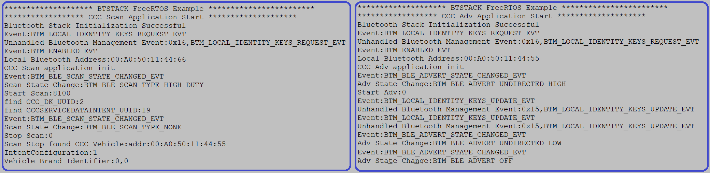
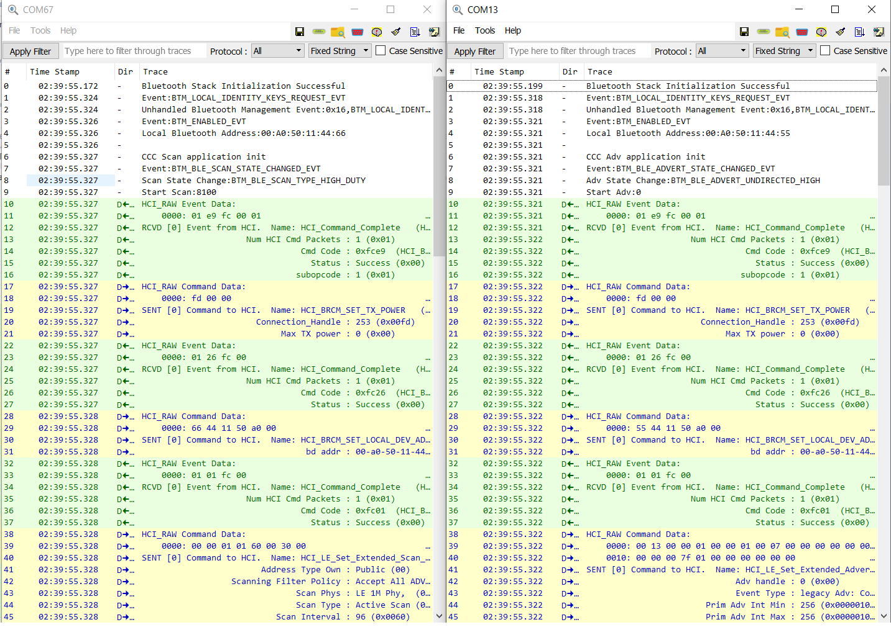

# Bluetooth&reg; LE Car Connectivity Consortium (CCC) Adv

This code example demonstrates the implementation of a Bluetooth&reg; LE custom service with Bluetooth&reg; security using AIROC&trade; CYW89829 devices and ModusToolbox&trade; environment.

[View this README on GitHub.](https://github.com/Infineon/mtb-example-btstack-freertos-ccc-adv)

[Provide feedback on this code example.](https://cypress.co1.qualtrics.com/jfe/form/SV_1NTns53sK2yiljn?Q_EED=eyJVbmlxdWUgRG9jIElkIjoiQ0UyMzkzOTIiLCJTcGVjIE51bWJlciI6IjAwMi0zOTM5MiIsIkRvYyBUaXRsZSI6IkJsdWV0b290aCZyZWc7IExFIENhciBDb25uZWN0aXZpdHkgQ29uc29ydGl1bSAoQ0NDKSBBZHYiLCJyaWQiOiJtYW94aW4iLCJEb2MgdmVyc2lvbiI6IjEuMC4wIiwiRG9jIExhbmd1YWdlIjoiRW5nbGlzaCIsIkRvYyBEaXZpc2lvbiI6Ik1DRCIsIkRvYyBCVSI6IklDVyIsIkRvYyBGYW1pbHkiOiJCVEFCTEUifQ==)


## Requirements

- [ModusToolbox&trade;](https://www.infineon.com/modustoolbox) v3.1 or later (tested with v3.1)
- Board support package (BSP) minimum required version for CYW989829M2EVB-01: v1.0.1
- Programming language: C


## Supported toolchains (make variable 'TOOLCHAIN')

- GNU Arm&reg; Embedded Compiler v10.3.1 (`GCC_ARM`) – Default value of `TOOLCHAIN`
- Arm&reg; Compiler v6.16 (`ARM`)
- IAR C/C++ Compiler v9.30.1 (`IAR`)


## Supported kits (make variable 'TARGET')

- [AIROC&trade; CYW89829 Bluetooth&reg; LE Evaluation Kit] (`CYW989829M2EVB-01`) – Default value of `TARGET`


## Hardware setup

This example uses the board's default configuration. See the kit user guide to ensure that the board is configured correctly.

> **Note:** The AIROC&trade; CYW89829 Bluetooth&reg; Kit (CYW989829M2EVB-01) ships with KitProg3 v2.21 installed. The ModusToolbox&trade; requires KitProg3 v2.40. Before using this code example, make sure that the board is upgraded to KitProg3. The tool and instructions are available in the [Firmware Loader](https://github.com/Infineon/Firmware-loader) GitHub repository. If you do not upgrade, you will see an error such as "unable to find CMSIS-DAP device" or "KitProg firmware is out of date".


## Software setup

See the [ModusToolbox&trade; tools package installation guide](https://www.infineon.com/ModusToolboxInstallguide) for information about installing and configuring the tools package.

Install a terminal emulator if you don't have one. Instructions in this document use [Tera Term](https://teratermproject.github.io/index-en.html).


## Using the code example

Create the project and open it using one of the following:

<details><summary><b>In Eclipse IDE for ModusToolbox&trade; </b></summary>

1. Click the **New Application** link in the **Quick Panel** (or, use **File** > **New** > **ModusToolbox&trade; Application**). This launches the [Project Creator](https://www.infineon.com/ModusToolboxProjectCreator) tool.

2. On the **Choose Board Support Package (BSP)** page, select a kit supported by this code example. See the [Supported kits](#supported-kits-make-variable-target) section.

   When you select a supported kit, the example is reconfigured automatically to work with the kit. To work with a different supported kit later, use the [Library Manager](https://www.infineon.com/ModusToolboxLibraryManager) to choose the BSP for the supported kit. You can use the Library Manager to select or update the BSP and firmware libraries used in this application. To access the Library Manager, click on the link from the **Quick Panel**.

   You can just start the application creation process again and select a different kit.

    > **Note:** To use this code example for a kit not listed here, you may need to update the source files. If the kit does not have the required resources, the application may not work.

3. In the **Project Creator - Select Application** dialog:

   a. Choose the code example from the list by enabling the checkbox.

   > **Note:** You can narrow the list of displayed examples by typing in the filter box.

   b. (Optional) Change the suggested **New Application Name**.

   c. The **Application(s) Root Path** defaults to the Eclipse workspace which is usually the desired location for the application. If you want to store the application in a different location, you can change the *Application(s) Root Path* value. Applications that share libraries should be in the same root path.

   d. Click **Create** to complete the application creation process.

For more details, see the [Eclipse IDE for ModusToolbox&trade; user guide](https://www.infineon.com/MTBEclipseIDEUserGuide) (locally available at *{ModusToolbox&trade; install directory}/docs_{version}/mtb_ide_user_guide.pdf*).

</details>

<details><summary><b>In command-line interface CLI</b></summary>

ModusToolbox&trade; tools package provides the Project Creator as both a GUI tool and a command line tool, 'project-creator-cli'. The CLI tool can be used to create applications from a CLI terminal or from within batch files or shell scripts. This tool is available in the *{ModusToolbox&trade; install directory}/tools_{version}/project-creator/* directory.

Use a CLI terminal to invoke the 'project-creator-cli' tool. On Windows, use the command-line 'modus-shell' program provided in the ModusToolbox&trade; installation instead of a standard Windows command-line application. This shell provides access to all ModusToolbox&trade; tools. You can access it by typing 'modus-shell' in the search box in the Windows menu. In Linux and macOS, you can use any terminal application.

The 'project-creator-cli' tool has the following arguments:

Argument | Description | Required/optional
---------|-------------|-----------
`--board-id` | Defined in the `<id>` field of the [BSP](https://github.com/Infineon?q=bsp-manifest&type=&language=&sort=) manifest | Required
`--app-id`   | Defined in the `<id>` field of the [CE](https://github.com/Infineon?q=ce-manifest&type=&language=&sort=) manifest | Required
`--target-dir`| Specify the directory in which the application is to be created if you prefer not to use the default current working directory | Optional
`--user-app-name`| Specify the name of the application if you prefer to have a name other than the example's default name | Optional

<br>

The following example clones the "[LE CCC Adv](https://github.com/Infineon/mtb-example-btstack-freertos-ccc-scan)" application with the desired name "LeCccAdv" configured for the *CYW989829M2EVB-01* BSP into the specified working directory, *C:/mtb_projects*:

   ```
   project-creator-cli --board-id CYW989829M2EVB-01 --app-id mtb-example-btstack-freertos-ccc-adv --user-app-name "LeCccsAdv" --target-dir "C:/mtb_projects"
   ```

> **Note:** The project-creator-cli tool uses the `git clone` and `make getlibs` commands to fetch the repository and import the required libraries. For details, see the 'Project creator tools' section of the [ModusToolbox&trade; user guide](https://www.infineon.com/ModusToolboxUserGuide) (locally available at *{ModusToolbox&trade; install directory}/docs_{version}/mtb_user_guide.pdf*).

To work with a different supported kit later, use the [Library Manager](https://www.infineon.com/ModusToolboxLibraryManager) to choose the BSP for the supported kit. You can invoke the Library Manager GUI tool from the terminal using `make library-manager` command or use the Library Manager CLI tool 'library-manager-cli' to change the BSP.

The 'library-manager-cli' tool has the following arguments:

Argument | Description | Required/optional
---------|-------------|-----------
`--add-bsp-name` | Name of the BSP that should be added to the application | Required
`--set-active-bsp` | Name of the BSP that should be as active BSP for the application | Required
`--add-bsp-version`| Specify the version of the BSP that should be added to the application if you do not wish to use the latest from manifest | Optional
`--add-bsp-location`| Specify the location of the BSP (local/shared) if you prefer to add the BSP in a shared path | Optional

<br>

The following example adds the CYW89829 BSP to the already created application and makes it the active BSP for the app.

```
library-manager-cli --project "C:/mtb_projects/LeCccAdv" --add-bsp-name CYW989829M2EVB-01 --add-bsp-version "latest-v4.X" --add-bsp-location "local"

library-manager-cli --project "C:/mtb_projects/LeCccAdv" --set-active-bsp APP_CYW989829M2EVB-01
```

</details>

<details><summary><b>In third-party IDEs</b></summary>

Use one of the following options:

- Use the standalone [Project Creator](https://www.infineon.com/ModusToolboxProjectCreator) tool.

1. Launch Project Creator from the Windows Start menu or from *{ModusToolbox&trade; install directory}/tools_{version}/project-creator/project-creator.exe*.

2. In the initial **Choose Board Support Package** screen, select the BSP, and click **Next**.

3. In the **Select Application** screen, select the appropriate IDE from the **Target IDE** drop-down menu.

4. Click **Create** and follow the instructions printed in the bottom pane to import or open the exported project in the respective IDE.

<br>

- Use **command-line interface** (CLI):

1. Follow the instructions from the **In command-line interface** (CLI) section to create the application.

2. Export the application to a supported IDE using the `make <ide>` command.

3. Follow the instructions displayed in the terminal to create or import the application as an IDE project.

For a list of supported IDEs and more details, see the "Exporting to IDEs" section of the [ModusToolbox&trade; user guide](https://www.infineon.com/ModusToolboxUserGuide) (locally available at *{ModusToolbox&trade; install directory}/docs_{version}/mtb_user_guide.pdf*).

</details>


## Operation

1. Connect the board to your PC using the provided USB cable through the KitProg3 USB connector.

2. Use a serial terminal application tool of your choice and connect it to the KitProg3 COM port. Configure the terminal application to access the serial port using the following settings:

   Baud rate: 115200 bps; Data: 8 bits; Parity: None; stop: 1 bit; Flow control: None; New line for receiving data: Line Feed (LF) or auto setting.

3. Program the board using one of the following:

   <details><summary><b>Using Eclipse IDE</b></summary>

      1. Select the application project in the Project Explorer.

      2. In the **Quick Panel**, scroll down, and click **\<Application Name> Program (KitProg3_MiniProg4)**.
   </details>


   <details><summary><b>In other IDEs</b></summary>

   Follow the instructions in your preferred IDE.
   </details>

   <details><summary><b>Using CLI</b></summary>

   From the terminal, execute the `make program` command to build and program the application using the default toolchain to the default target. The default toolchain and target are specified in the application's Makefile but you can override those values manually:
   ```
   make program TARGET=<BSP> TOOLCHAIN=<toolchain>
   ```

   For Example:
   ```
   make program TARGET=CYW989829M2EVB-01 TOOLCHAIN=GCC_ARM
   ```
   </details>

4. After programming, the application starts automatically with the CCC Scan and CCC Adv applications. Observe the messages on the UART terminal; CCC Adv will start advertisement, and CCC Scan will start scanning. If the CCC Scan application finds the advertisement data, it will print the CCC_DK_UUID and CCCSERVICEDATAINTENT_UUID. To see the Bluetooth&reg; stack and application trace messages in the terminal window, use the KitProg3 COM port.

   **Figure 1. Log messages on KitProg3 COM port**

   
   
5. Configure the CCC Scan and Adv parameters as shown below:

   **CCC Scan Parameters:**

   Parameter | Description
   ----------|------------
   `high_duty_scan_interval` | High duty scan interval (in slots (1 slot = 0.625 ms))
   `high_duty_scan_window` | High duty scan window (in slots (1 slot = 0.625 ms))
   `high_duty_scan_duration` | High duty scan duration in seconds ('0' for infinite)

   <br>

   **CCC Adv parameters:**

   Parameter | Description
   ----------|------------
   `high_duty_min_interval` | High duty undirected connectable minimum advertising interval (in slots (1 slot = 0.625 ms))
   `high_duty_max_interval` | High duty undirected connectable maximum advertising interval (in slots (1 slot = 0.625 ms))
   `high_duty_duration` | High duty undirected connectable advertising duration in seconds ('0' for infinite)

   <br>

   > **Note:** For more details on the CCC Adv data fields, See [Car Connectivity Consortium](https://carconnectivity.org/digital-key/).
 
6. Scan will stop after finding CCC advertisements or exceeding the `CY_BT_HIGH_DUTY_SCAN_DURATION` time. Advertisement will stop after `CY_BT_HIGH_DUTY_ADV_DURATION`. Press the user button on the board to restart scan and advertisement.


## Steps to enable BTSpy logs

1. Navigate to the application Makefile and open it. Find the `ENABLE_SPY_TRACES` Makefile variable and set it to the value '1' as follows:

    ```
    ENABLE_SPY_TRACES = 1
    ```
2. Save the Makefile, and then build and program the application to the board.

3. Open the [ClientControl](https://github.com/Infineon/btsdk-host-apps-bt-ble/tree/master/client_control) application and make the following settings:
   - Set the baud rate to 3000000.
   - Deselect flow control.
   - Select the serial port and click on an open port.

4. Launch the [BTSpy](https://github.com/Infineon/btsdk-utils/tree/master/BTSpy) tool.

5. Press and release the reset button on the board to get the BTSpy logs on the BTSpy tool.

   **Figure 2. BTSpy log messages**

   


## Debugging

You can debug the example to step through the code.
<details><summary><b>In Eclipse IDE</b></summary>

Use the **\<Application Name> Debug (KitProg3_MiniProg4)** configuration in the **Quick Panel**. For details, see the "Program and debug" section in the [Eclipse IDE for ModusToolbox&trade; user guide](https://www.infineon.com/MTBEclipseIDEUserGuide).
<br>

</details>

<details><summary><b>In other IDEs</b></summary>
Follow the instructions in your preferred IDE.
</details>


## Design and implementation

This code example configures CCC scan and CCC Adv as Bluetooth&reg; GAP central and GAP peripheral. The peripheral sends an advertisement using CCC_DK_UUID and CCCSERVICEDATAINTENT_UUID. These two UUIDs are centrally scanned and filtered to ensure the advertisement sender's identity. The user button is used to restart the scanning/advertising once the scanning/advertising duration has passed. To print debug messages on the UART terminal emulator, the application makes use of a UART resource from the Hardware Abstraction Layer (HAL). The retarget-io library is used to initialize the UART resources and retarget standard I/O to the UART port.

Log from CCC Scan |Log from CCC Adv
---------------------|--------------------
`CCC Scan Application Start` |CCC Adv application start
`Bluetooth Stack Initialization Successful` |Bluetooth&reg; stack initialization successful
`Event:BTM_ENABLED_EVT` |Event: BTM_ENABLED_EVT
`Local Bluetooth Address:00:A0:50:11:44:66` |Local Bluetooth&reg; address: 00:A0:50:11:44:55
`CCC Scan application init` |CCC Adv application init
`Event:BTM_BLE_SCAN_STATE_CHANGED_EVT` |Event: BTM_BLE_ADVERT_STATE_CHANGED_EVT
`Scan State Change:BTM_BLE_SCAN_TYPE_HIGH_DUTY` |Adv state change: BTM_BLE_ADVERT_UNDIRECTED_HIGH
`Start Scan:8100` |Start Adv: '0'
`find CCC_DK_UUID:2` |
`find CCCSERVICEDATAINTENT_UUID:19` |
`Event:BTM_BLE_SCAN_STATE_CHANGED_EVT` |
`Scan State Change:BTM_BLE_SCAN_TYPE_NONE` |
`Stop Scan:0` |
`Scan Stop found CCC Vehicle:addr:00:A0:50:11:44:55` |
`IntentConfiguration:1` |
`Vehicle_Brand_Identifier:0,0` |

<br>

## Resources and settings

This section explains ModusToolbox&trade; resources and their configurations as used in this code example.

> **Note:** All the configurations explained in this section have already been implemented in the code example.

- **Device Configurator:** ModusToolbox&trade; stores the configuration settings of the application in the *design.modus* file. This file is used by the Device Configurator, which generates the configuration firmware. This firmware is stored in the application’s *GeneratedSource* folder.

   By default, all applications in a workspace share the same *design.modus* file - that is, they share the same pin configuration. Each BSP has a default *design.modus* file in the *mtb_shared\TARGET_\<bsp name\>\<version\>\COMPONENT_BSP_DESIGN_MODUS* directory. It is not recommended to modify the configuration of a standard BSP directly.

   To modify the configuration for a single application or to create a custom BSP, see the [ModusToolbox&trade; user guide](https://www.infineon.com/ModusToolboxUserGuide). This example uses the default configuration. See the [Device Configurator guide](https://www.infineon.com/ModusToolboxDeviceConfig).

- **Bluetooth&reg; Configurator:** The Bluetooth&reg; peripheral has an additional configurator called the 'Bluetooth&reg; Configurator' that is used to generate the Bluetooth&reg; LE GATT database and various Bluetooth&reg; settings for the application. These settings are stored in the file named *design.cybt*.

> **Note:** Unlike the Device Configurator, the Bluetooth&reg; Configurator settings and files are local to each respective application. The services and characteristics added are explained in the [Design and implementation](#design-and-implementation) section. See the [Bluetooth&reg; Configurator guide](https://www.infineon.com/ModusToolboxBLEConfig) for further information.

> **Note:** For CYW20829/CYW89829, if you want to use the Bluetooth&reg; Configurator tool, select the **AIROC&trade; BTSTACK with Bluetooth&reg; LE** only (CYW20829/CYW89829, PSoC&trade; 6 with CYW43xxx connectivity device) option from the drop-down menu to select the device. Do not use the PSoC&trade; Bluetooth&reg; LE Legacy Stack (PSoC&trade; 6-BLE) option because it is not compatible with AIROC&trade; BTSTACK.

**Table 1. Application resources**

Resource  |  Alias/object     |    Purpose
:------- | :------------    | :------------
UART (HAL) |cy_retarget_io_uart_obj | UART HAL object used by Retarget-IO for the debug UART port
GPIO (HAL)    | CYBSP_USER_LED2         | This LED serves as an indication for advertisement and scan start blinking 10 second
GPIO (HAL)    | CYBSP_USER_BTN         | Used to start scan or advertisement

<br>

## Related resources

Resources  | Links
-----------|----------------------------------
Application notes  | [AN228571](https://www.infineon.com/AN228571) – Getting started with PSoC&trade; 6 MCU on ModusToolbox&trade; <br>  [AN215656](https://www.infineon.com/AN215656) – PSoC&trade; 6 MCU: Dual-CPU system design
Code examples  | [Using ModusToolbox&trade;](https://github.com/Infineon/Code-Examples-for-ModusToolbox-Software) on GitHub
Device documentation | [PSoC&trade; 6 MCU datasheets](https://www.infineon.com/cms/en/search.html#!view=downloads&term=psoc6&doc_group=Data%20Sheet) <br> [PSoC&trade; 6 technical reference manuals](https://www.infineon.com/cms/en/search.html#!view=downloads&term=psoc6&doc_group=Additional%20Technical%20Information)<br>[AIROC&trade; CYW20829 Bluetooth&reg; LE SoC](https://www.infineon.com/cms/en/product/promopages/airoc20829)<br>[AIROC&trade; CYW89829 Bluetooth&reg; LE SoC]
Development kits | Select your kits from the [Evaluation board finder](https://www.infineon.com/cms/en/design-support/finder-selection-tools/product-finder/evaluation-board)
Libraries on GitHub  | [mtb-pdl-cat1](https://github.com/Infineon/mtb-pdl-cat1) – PSoC&trade; 6 Peripheral Driver Library (PDL)  <br> [mtb-hal-cat1](https://github.com/Infineon/mtb-hal-cat1) – Hardware Abstraction Layer (HAL) library <br> [retarget-io](https://github.com/Infineon/retarget-io) – Utility library to retarget STDIO messages to a UART port
Middleware on GitHub  | [capsense](https://github.com/Infineon/capsense) – CAPSENSE&trade; library and documents <br> [psoc6-middleware](https://github.com/Infineon/modustoolbox-software#psoc-6-middleware-libraries) – Links to all PSoC&trade; 6 MCU middleware
Tools  | [Eclipse IDE for ModusToolbox&trade;](https://www.infineon.com/modustoolbox) – ModusToolbox&trade; software is a collection of easy-to-use libraries and tools enabling rapid development with Infineon MCUs for applications ranging from embedded sense and control to wireless and cloud-connected systems using AIROC&trade; Wi-Fi and Bluetooth&reg; connectivity devices.

<br>

## Other resources

Infineon provides a wealth of data at [www.infineon.com](https://www.infineon.com) to help you select the right device, and quickly and effectively integrate it into your design.

## Document history

Document title: *CE239392* – *Bluetooth&reg; LE Car Connectivity Consortium (CCC) Adv*

 Version | Description of change
 ------- | ---------------------
 1.0.0   | New code example

<br>

All referenced product or service names and trademarks are the property of their respective owners.

The Bluetooth&reg; word mark and logos are registered trademarks owned by Bluetooth SIG, Inc., and any use of such marks by Infineon is under license.


-------------------------------------------------------------------------------

© Cypress Semiconductor Corporation, 2023-2024. This document is the property of Cypress Semiconductor Corporation, an Infineon Technologies company, and its affiliates ("Cypress").  This document, including any software or firmware included or referenced in this document ("Software"), is owned by Cypress under the intellectual property laws and treaties of the United States and other countries worldwide.  Cypress reserves all rights under such laws and treaties and does not, except as specifically stated in this paragraph, grant any license under its patents, copyrights, trademarks, or other intellectual property rights.  If the Software is not accompanied by a license agreement and you do not otherwise have a written agreement with Cypress governing the use of the Software, then Cypress hereby grants you a personal, non-exclusive, nontransferable license (without the right to sublicense) (1) under its copyright rights in the Software (a) for Software provided in source code form, to modify and reproduce the Software solely for use with Cypress hardware products, only internally within your organization, and (b) to distribute the Software in binary code form externally to end users (either directly or indirectly through resellers and distributors), solely for use on Cypress hardware product units, and (2) under those claims of Cypress’s patents that are infringed by the Software (as provided by Cypress, unmodified) to make, use, distribute, and import the Software solely for use with Cypress hardware products.  Any other use, reproduction, modification, translation, or compilation of the Software is prohibited.
<br>
TO THE EXTENT PERMITTED BY APPLICABLE LAW, CYPRESS MAKES NO WARRANTY OF ANY KIND, EXPRESS OR IMPLIED, WITH REGARD TO THIS DOCUMENT OR ANY SOFTWARE OR ACCOMPANYING HARDWARE, INCLUDING, BUT NOT LIMITED TO, THE IMPLIED WARRANTIES OF MERCHANTABILITY AND FITNESS FOR A PARTICULAR PURPOSE.  No computing device can be absolutely secure.  Therefore, despite security measures implemented in Cypress hardware or software products, Cypress shall have no liability arising out of any security breach, such as unauthorized access to or use of a Cypress product. CYPRESS DOES NOT REPRESENT, WARRANT, OR GUARANTEE THAT CYPRESS PRODUCTS, OR SYSTEMS CREATED USING CYPRESS PRODUCTS, WILL BE FREE FROM CORRUPTION, ATTACK, VIRUSES, INTERFERENCE, HACKING, DATA LOSS OR THEFT, OR OTHER SECURITY INTRUSION (collectively, "Security Breach").  Cypress disclaims any liability relating to any Security Breach, and you shall and hereby do release Cypress from any claim, damage, or other liability arising from any Security Breach.  In addition, the products described in these materials may contain design defects or errors known as errata which may cause the product to deviate from published specifications. To the extent permitted by applicable law, Cypress reserves the right to make changes to this document without further notice. Cypress does not assume any liability arising out of the application or use of any product or circuit described in this document. Any information provided in this document, including any sample design information or programming code, is provided only for reference purposes.  It is the responsibility of the user of this document to properly design, program, and test the functionality and safety of any application made of this information and any resulting product.  "High-Risk Device" means any device or system whose failure could cause personal injury, death, or property damage.  Examples of High-Risk Devices are weapons, nuclear installations, surgical implants, and other medical devices.  "Critical Component" means any component of a High-Risk Device whose failure to perform can be reasonably expected to cause, directly or indirectly, the failure of the High-Risk Device, or to affect its safety or effectiveness.  Cypress is not liable, in whole or in part, and you shall and hereby do release Cypress from any claim, damage, or other liability arising from any use of a Cypress product as a Critical Component in a High-Risk Device. You shall indemnify and hold Cypress, including its affiliates, and its directors, officers, employees, agents, distributors, and assigns harmless from and against all claims, costs, damages, and expenses, arising out of any claim, including claims for product liability, personal injury or death, or property damage arising from any use of a Cypress product as a Critical Component in a High-Risk Device. Cypress products are not intended or authorized for use as a Critical Component in any High-Risk Device except to the limited extent that (i) Cypress’s published data sheet for the product explicitly states Cypress has qualified the product for use in a specific High-Risk Device, or (ii) Cypress has given you advance written authorization to use the product as a Critical Component in the specific High-Risk Device and you have signed a separate indemnification agreement.
<br>
Cypress, the Cypress logo, and combinations thereof, ModusToolbox, PSoC, CAPSENSE, EZ-USB, F-RAM, and TRAVEO are trademarks or registered trademarks of Cypress or a subsidiary of Cypress in the United States or in other countries. For a more complete list of Cypress trademarks, visit [www.infineon.com](https://www.infineon.com) Other names and brands may be claimed as property of their respective owners.